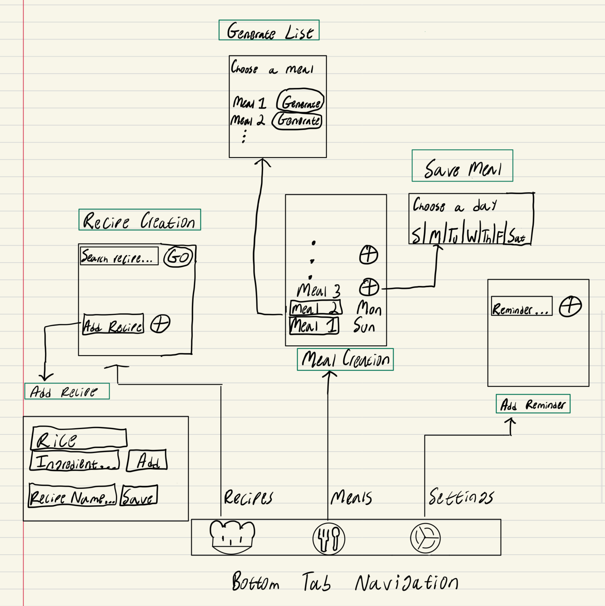
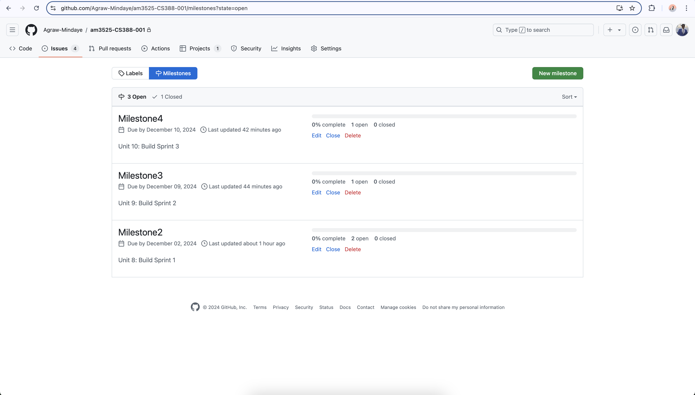
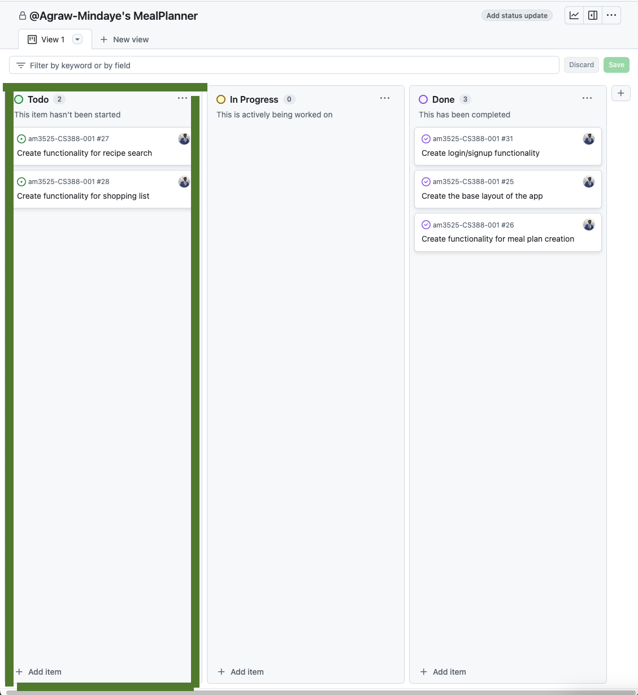
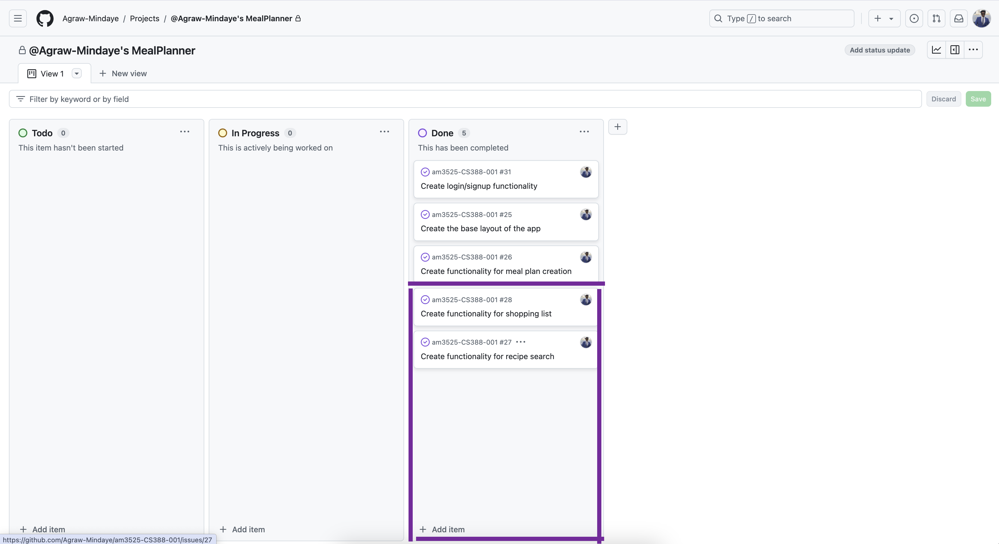

# Milestone 1 - Meal Planner (Unit 7)

## Project Requirements
- [CS388 Project Requirements](ProjectRequirements.md)

## Table of Contents

1. [Overview](#Overview)
1. [Product Spec](#Product-Spec)
1. [Wireframes](#Wireframes)

## Overview

### Description

*Meal Planner* is an app where users can generate shopping lists, track nutrition, and plan their weekly meals.

### App Evaluation

  - **Category**: Health & Wellness
	- **Mobile**: Mobile is essential for planning meals on the go and referencing shopping lists in stores.
	- **Story**: The app simplifies meal preparation, saves time, and encourages healthier eating habits.
	- **Market**: Targeted towards families, busy individuals, or anyaone looking to eat healthier.
	- **Habit**: Users interact with the app weekly to plan meals and daily to track nutrition.
	- **Scope**: V1 would allow users to create meal plans and shopping lists. V2 could add nutritional tracking. V3 might include recipe recommendations based on dietary preferences.

## Product Spec

### 1. User Features (Required and Optional)

**Required Features**

1. - [x] Login/SignUp: Users can login and/or sign up with an account
2. - [x] Meal Plan Creation: Users can create a meal plan by creating recipes and adding them to specific days
3. - [x] Nutritional Information: Each recipe displays nutritional details
4. - [x] Shopping List Generator: Users can generate shopping list based on meal plan

**Optional Features**

1. - [x] Recipe Search: Users can search for an onlien recipe
2. - [ ] Notifications: Users can set reminders to prepare meals and/or shop for ingredients
3. - [ ] Offline mode: Users can access their meal plans regardless of internet connection

### 2. Screen Archetypes

- [Login/SignUp Screen]
  - [Users can login and/or sign up with an account]
- [Recipe Creation Screen]
  - [Users can create recipes with ingredients]
  - [Users can also search for a recipe]
- [Meal Creation Screen]
  - [Users can save a recipe to a specific day]
- [Shopping List Generator Screen]
  - [Users can generate a shopping list by selecting a saved meal]
- [Settings Screen]
  - [Users can set reminders]

### 3. Navigation

**Tab Navigation** (Tab to Screen)

* [Recipe Creation Tab]
* [Meal Creation Tab]
* [Settings Tab]

**Flow Navigation** (Screen to Screen)

- [Login/SignUp Screen]
  - [Login and/or sign up]
- [Recipe Creation Screen]
  - [Add recipe]
  - [Search for recipe]
- [Meal Creation Screen]
  - [Save meal to specific day]
  - [Generate shopping list]
- [Settings Screen]
  - [Add reminder]

## Wireframes

 

 

# Milestone 2 - Build Sprint 1 (Unit 8)

## GitHub Project board

<!--- [Add screenshot of your Project Board with three milestones visible in this section] -->

- 

## Issue cards

<!--- [Add screenshot of your Project Board with the issues that you've been working on for this unit's milestone] -->

- 

<!--- [Add screenshot of your Project Board with the issues that you're working on in the **NEXT sprint**. It should include issues for next unit with assigned owners.] -->

- 

## Issues worked on this sprint

<!--- List the issues you completed this sprint -->

1. **Create functionality for login/signup**   
2. **Create the base layout of the app**:   
    ***Added login and sign up functionality***  
    ***Added bottom navigation***  
3. **Create functionality for meal plan creation**:  
    ***Added functionality for users to create recipes***  
    ***Added functionality for users to save recipes to a specific day***  

### Current Progress GIF
<!--- [Add giphy that shows current build progress for Milestone 2. Note: We will be looking for progression of work between Milestone 2 and 3. 
Make sure your giphys are not duplicated and clearly show the change from Sprint 1 to 2.] -->

- 

 

# Milestone 3 - Build Sprint 2 (Unit 9)

## GitHub Project board

[Add screenshot of your Project Board with the updated status of issues for Milestone 3. 
Note that these should include the updated issues you worked on for this sprint and not be a duplicate of Milestone 2 Project board.] 
- 

## Completed user stories

<!--- List the completed user stories from this unit -->

1. **Create functionality for shopping list**   
    ***Added functionality for users to be able to gnerate a shopping list based on a saved meal plan***  
2. **Create functionality for recipe search**:   
   ***Added functionality for users to search for on online recipe***  

- List any pending user stories / any user stories you decided to cut from the original requirements

1. **Create functionality for recipe search**:   
    ***This functionality wasn't cut, but it was changed to show online recipes instead of user-created recipes***  

[Add video/gif of your current application that shows build progress]
- 

## App Demo Video

- Embed the YouTube/Vimeo link of your Completed Demo Day prep video
  - [Demo Day Prep Video] https://youtu.be/0v4vDjgvPKY
